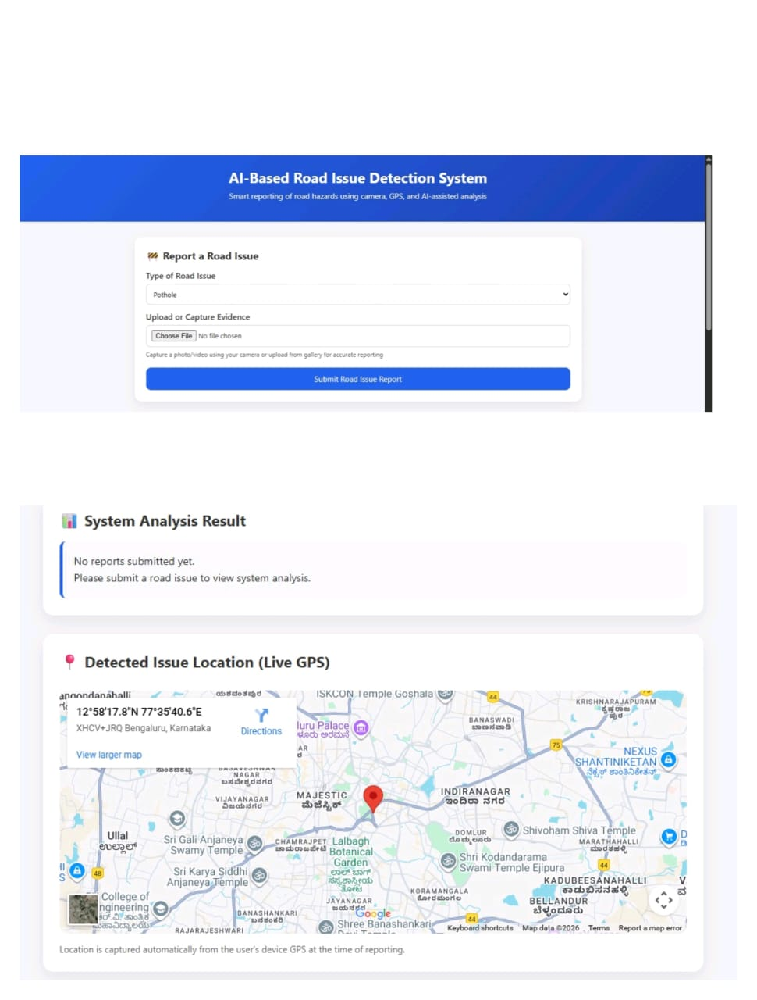
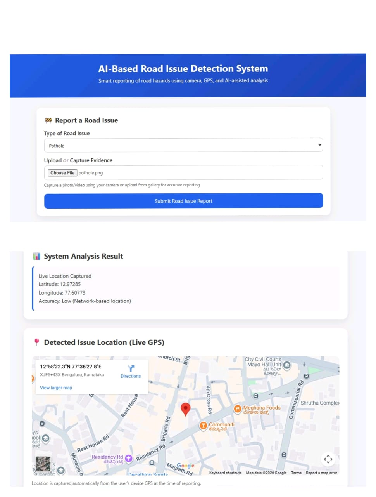

RoadIntel

RoadIntel is a location-aware road issue reporting platform that allows users to report problems such as potholes and broken streetlights using image evidence and GPS location.

Features
Google authentication using Firebase
Report potholes and broken streetlights
Upload or capture images as evidence
Automatic GPS location capture
Interactive public issue map
Personal report history
Duplicate image detection using SHA-256
Nearby duplicate issue detection
SQLite database for storing reports
Delete your own reports
Tech Stack

Frontend

HTML
CSS
JavaScript
Firebase Authentication
Leaflet
Leaflet MarkerCluster

Backend

Python
Flask
Flask-CORS
Flask-SQLAlchemy
SQLite
Project Structure
RoadIntel/
├── backend/
│   ├── app.py
│   ├── requirements.txt
│   └── .gitignore
├── frontend/
│   ├── index.html
│   ├── script.js
│   └── style.css
├── screenshots/
└── README.md

How It Works

Users sign in with Google, select the type of road issue, upload or capture an image, and provide their current location.

The backend validates the report before storing it. Images are checked using SHA-256 to prevent the same image from being submitted multiple times. Reports of the same issue type within a specific geographic distance are also rejected as duplicates.

Submitted reports are displayed on an interactive map along with their location and supporting image.

Run Locally

Clone the repository:

git clone https://github.com/AsishKethan2006/RoadIntel.git
cd RoadIntel

Install backend dependencies:

cd backend
pip install -r requirements.txt

Start the backend:

python app.py

Then open the frontend in a browser or serve it using a local HTTP server.

Make sure Firebase Authentication is configured before using Google sign-in.

Current Limitations

RoadIntel is currently a prototype. Issue types are selected manually, and the project does not currently include a computer-vision model for automatic road issue or severity detection.

Future versions can add AI-based detection, severity classification, an authority dashboard, report verification, notifications, and production-ready authentication and storage.

License

No open-source license has currently been specified for this project.

##  Use Case

- Smart city road monitoring
- Municipal corporation reporting
- Community-driven road safety
- Infrastructure maintenance prioritization

---

##  API Keys & Security

Google Maps API keys are required for map rendering.  
 **Do not expose API keys in production environments.**

---

##  Screenshots

### Homepage/Before Reporting Issue

### After Reporting Issue

##  Future Enhancements

- AI model for real-time pothole detection
- User authentication
- Admin dashboard for authorities
- Issue status tracking
- Heatmap visualization of road issues

