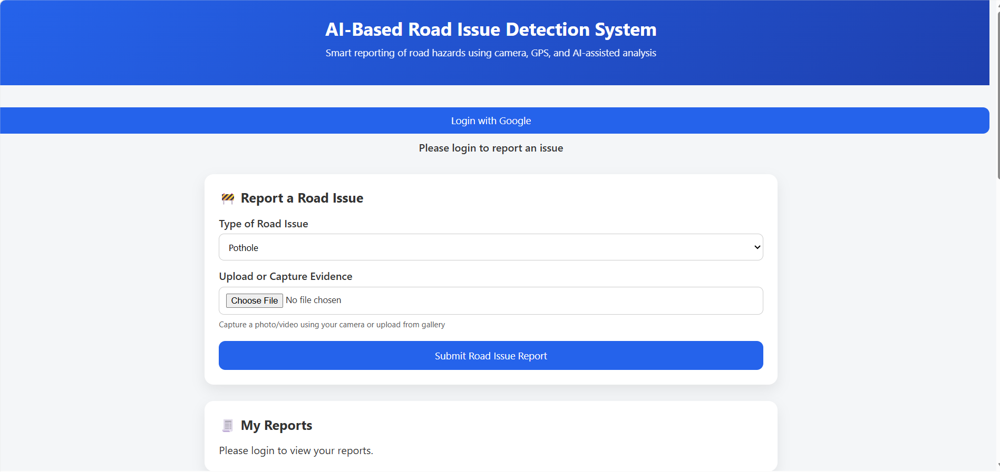
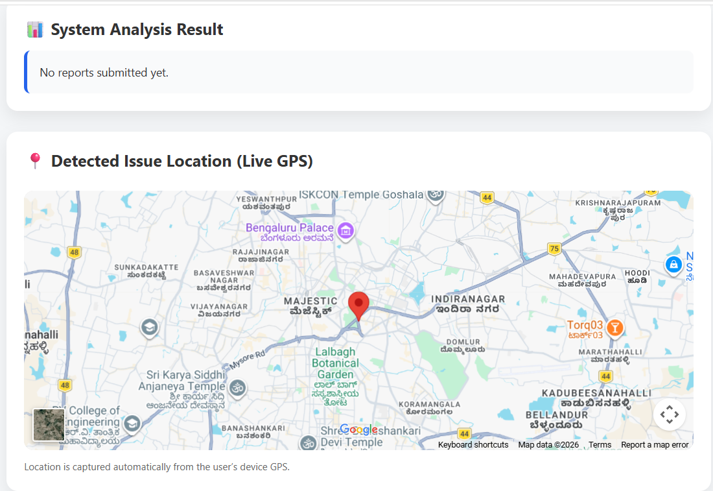
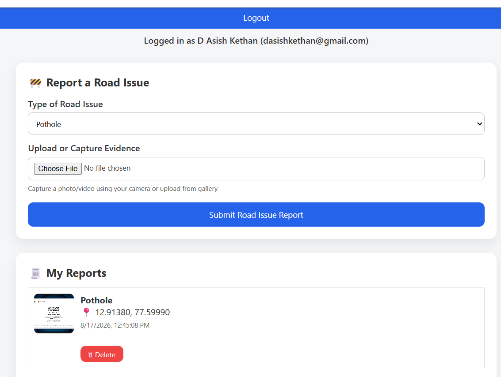
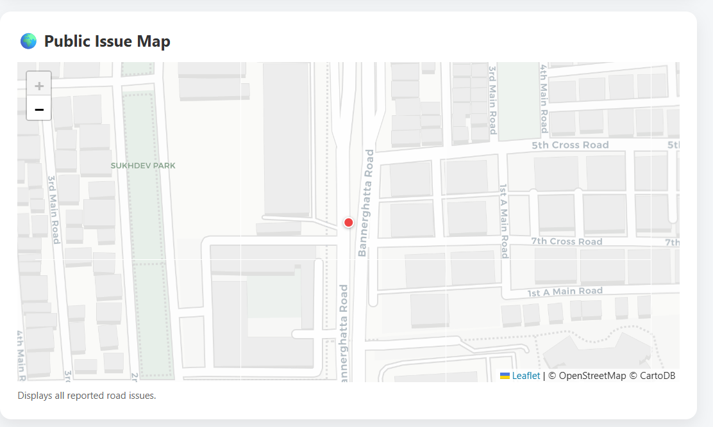

# RoadIntel

## Location-Aware Road Issue Reporting System

RoadIntel is a web-based road issue reporting platform that allows users to report road problems such as potholes and broken streetlights using photographic evidence and GPS location.

The system provides user authentication, location-aware reporting, duplicate detection, personal report history, and a public interactive map for visualizing reported road issues.

## Live Demo

**Frontend:**  
https://asishkethan2006.github.io/RoadIntel/

**Backend API:**  
https://roadintel.onrender.com/reports

## Features

- Google authentication using Firebase
- Reporting of potholes and broken streetlights
- Photographic evidence upload
- Automatic GPS location capture
- Interactive public issue map
- Location-based road issue visualization
- Personal report history
- Ability to delete submitted reports
- SHA-256 based duplicate image detection
- Location-based duplicate report detection
- SQLite database for report storage
- Cloud deployment of frontend and backend

## Technology Stack

### Frontend

- HTML5
- CSS3
- JavaScript
- Firebase Authentication
- Leaflet
- Leaflet MarkerCluster

### Backend

- Python
- Flask
- Flask-CORS
- Flask-SQLAlchemy
- SQLite
- Gunicorn

### Deployment

- GitHub Pages — Frontend
- Render — Backend
- Firebase — Authentication

## System Architecture

```text
                         User
                          |
                          v
                 +------------------+
                 |   GitHub Pages   |
                 | HTML / CSS / JS  |
                 +--------+---------+
                          |
                     API Requests
                          |
                          v
                 +------------------+
                 |      Render      |
                 |  Flask Backend   |
                 +--------+---------+
                          |
                 +--------+---------+
                 |                  |
                 v                  v
        +----------------+  +----------------+
        | SQLite Database|  | Image Storage  |
        +----------------+  +----------------+

                 Firebase Authentication
                          |
                          v
                    Google Sign-In
```

## Project Structure

```text
RoadIntel/
|
├── backend/
│   ├── app.py
│   ├── requirements.txt
│   └── .gitignore
|
├── frontend/
│   ├── index.html
│   ├── script.js
│   └── style.css
|
├── screenshots/
│   ├── r1.png
│   ├── r2.png
│   ├── r3.png
│   └── r4.png
|
├── .github/
│   └── workflows/
│       └── deploy.yml
|
└── README.md
```

## Screenshots

### Before Reporting an Issue

#### Application Interface



#### Road Issue Reporting Interface



### After Reporting an Issue

#### User Report History



#### Public Issue Map



## Application Workflow

```text
1. User opens RoadIntel
          |
          v
2. User signs in using Google
          |
          v
3. User selects the road issue type
          |
          v
4. User uploads or captures evidence
          |
          v
5. GPS location is captured
          |
          v
6. Report is sent to the Flask backend
          |
          v
7. Duplicate checks are performed
          |
          v
8. Report is stored in the database
          |
          v
9. User can view the submitted report
          |
          v
10. Issue is displayed on the public map
```

## Road Issue Reporting

Users can select the type of road issue, upload photographic evidence, and submit a report.

Currently supported road issue types include:

- Pothole
- Broken Streetlight

The application automatically captures the user's GPS coordinates when submitting a report.

## Public Issue Map

All reported road issues are displayed on an interactive map.

The map provides a geographic representation of reported issues and allows users to identify the locations of reported road problems.

Leaflet is used for map visualization and Leaflet MarkerCluster is used for managing map markers.

## Authentication

RoadIntel uses Firebase Authentication with Google Sign-In.

Authentication allows users to:

- Sign in securely
- Submit road issue reports
- View their own reports
- Delete their own reports

## Duplicate Detection

RoadIntel implements two mechanisms for reducing duplicate reports.

### Image Duplicate Detection

Uploaded images are processed using SHA-256 hashing to identify duplicate image submissions.

### Location Duplicate Detection

The system checks the geographic location of submitted reports to identify potential duplicate reports from nearby locations.

## Deployment

The application is deployed using free cloud hosting services.

### Frontend

The frontend is deployed using GitHub Pages.

```text
https://asishkethan2006.github.io/RoadIntel/
```

### Backend

The Flask backend is deployed using Render.

```text
https://roadintel.onrender.com
```

### Authentication

Google authentication is provided through Firebase Authentication.

## API

The backend exposes API endpoints for managing road issue reports.

Example endpoint:

```text
GET /reports
```

Live endpoint:

```text
https://roadintel.onrender.com/reports
```

## Current Deployment Considerations

The current demonstration version uses SQLite and local file storage for uploaded evidence.

This setup is suitable for a mini-project demonstration. For production-scale deployment, persistent database storage and cloud-based image storage can be integrated.

## Future Enhancements

- Automatic road issue classification using machine learning
- Administrative dashboard for authorities
- Road issue statistics and analytics
- City-wide road condition analysis
- Notifications for report status updates
- Persistent cloud image storage
- PostgreSQL or another production database
- Authority and administrator accounts
- Progressive Web App or mobile application

## Use Cases

RoadIntel can be used for:

- Community-based road issue reporting
- Smart city infrastructure monitoring
- Municipal road maintenance
- Road safety monitoring
- Infrastructure maintenance planning

## Project Status

The current version provides a functional end-to-end road issue reporting system with:

- User authentication
- GPS-based reporting
- Image evidence upload
- Duplicate detection
- Personal report management
- Public issue visualization
- Cloud deployment

## Author

**Asish Kethan**

RoadIntel — Location-Aware Road Issue Reporting System
